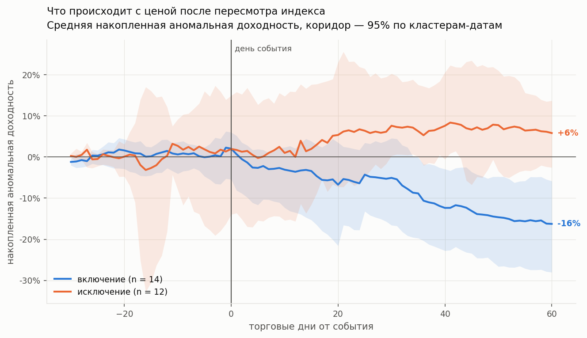
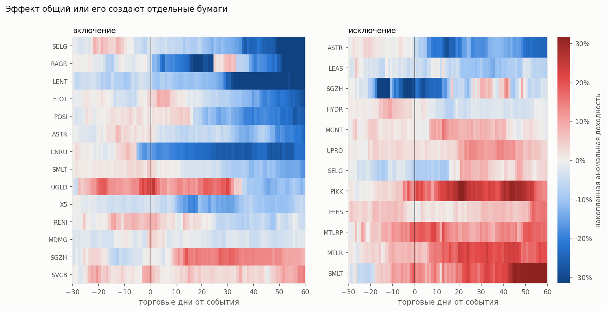
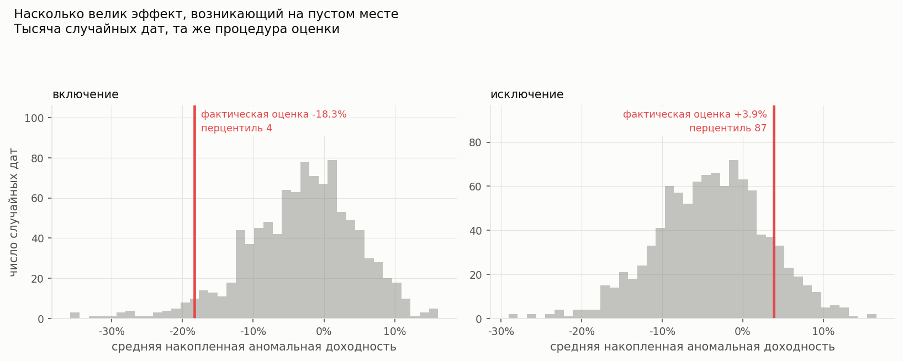
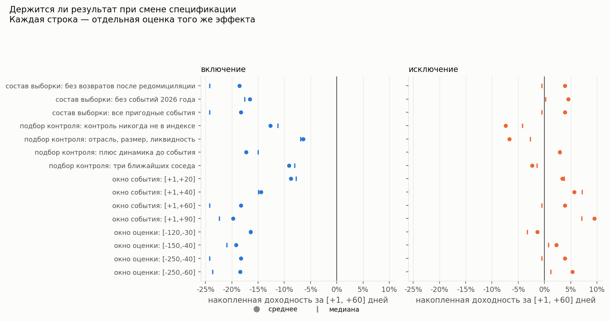
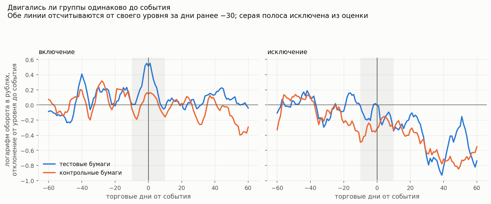
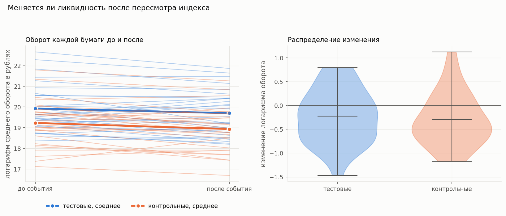

# Индексный эффект на Московской бирже

Событийное исследование того, что происходит с ценой и ликвидностью акции,
когда её включают в индекс МосБиржи или исключают из него. Данные собраны
самостоятельно через открытый API биржи; период — январь 2022 — сентябрь 2026;
42 события, из них 26 пригодны для анализа цены.

**Короткий ответ.** Классического индексного эффекта — роста цены к моменту
включения с последующим откатом — в данных нет. Цена не растёт ни перед
включением, ни в день сделки индексных фондов. Зато после включения она
устойчиво снижается: за 60 торговых дней накопленная аномальная доходность
составляет −18.3%, и отрицательна она у 12 бумаг из 14. Эффект переживает все
пятнадцать проверок устойчивости и плацебо-тест, но значимость его
пограничная: рандомизационный p-значение равен 0.039. Исключения из индекса
симметричного эффекта не дают — там не обнаруживается ничего. При этом сам
механизм наблюдается напрямую: в дни ребалансировки оборот включаемых бумаг
удваивается, а устойчивого изменения ликвидности за этим не следует.

---

## 1. Вопрос и почему он нетривиален

Индексные фонды обязаны держать бумаги в тех же пропорциях, что и индекс.
Когда биржа объявляет о включении акции в базу расчёта, фонды обязаны её
купить — независимо от того, что они думают о компании. Возникает спрос,
не связанный с фундаментальными показателями.

Если бы рынок был совершенно ликвиден, такой спрос не двигал бы цену:
нашлись бы продавцы, готовые отдать бумагу по прежней цене. Наблюдаемая
реакция цены поэтому измеряет не качество компании, а наклон кривой
предложения — насколько дорого обходится рынку переварить крупную
вынужденную заявку.

Что происходит дальше — вопрос открытый, и ответ на него различает две
конкурирующие гипотезы:

* **давление на цену**: спрос временный, за скачком следует откат, и через
  несколько месяцев цена возвращается к прежнему уровню;
* **несовершенные заменители**: кривая спроса на конкретную акцию имеет
  наклон, доля бумаг, осевшая у индексных фондов, навсегда уходит из
  свободного обращения, и новый уровень цены сохраняется.

На американском рынке эффект был силён в девяностые и заметно ослаб к
2010-м: рынок научился торговать ребалансировки заранее, и арбитражёры
выкупают бумагу до того, как это сделают фонды. По российскому рынку
систематических работ мало, а условия здесь другие: доля индексных фондов
в обороте меньше, а после 2022 года состав индекса пересматривался чаще
обычного из-за делистингов и смены юрисдикции эмитентами.

**Ответ заранее не был известен.** Случайно включить половину компаний в
индекс нельзя, поэтому это естественный эксперимент, и работать с ним нужно
методами причинно-следственного вывода.

---

## 2. Данные

Источник — открытый ISS API Московской биржи, без ключа и регистрации.
Выгрузка воспроизводится командой `make data`.

| Что | Объём |
|---|---|
| История членства в IMOEX | 127 интервалов, 2001-01-03 … 2026-09-18 |
| Котировки бумаг событий и контроля | 198 321 строка, 160 бумаг, 2021-01-04 … 2026-09-18 |
| История индекса IMOEX | 1 435 торговых дней |
| Справочник режима TQBR | 506 бумаг |
| Отраслевые индексы | 10 индексов, 270 бумаг |

**42 события в окне 2022-01-03 … 2026-09-15:** 19 включений и 23 исключения.

Дата события определена симметрично: `t = 0` — первый торговый день, в
котором действует новый статус бумаги. Для включения это первый день в
индексе, для исключения — первый торговый день после последнего дня в
индексе. При таком определении сделка индексного фонда в обоих случаях
приходится на закрытие `t = −1`, и две стороны сравнимы напрямую.

### Три особенности данных, которые пришлось учесть

**Эндпоинт состава отдаёт не полную историю.** 127 записей — это 127
уникальных тикеров, по одному интервалу членства на каждый. Если бумага
включалась в индекс повторно, ранние интервалы затёрты.

**Поле `till` у действующих членов — это край данных, а не исключение.**
У 44 бумаг оно равно 2026-09-18, последней доступной дате. Принять их за
исключения означало бы получить 44 фантомных события.

**В дни остановки торгов биржа отдаёт строки с пустой ценой.** Весной
2022 года торги акциями стояли 27 дней, с 25 февраля по 24 марта, и за
этот период в выгрузке лежат строки с `CLOSE = NULL` и нулевым оборотом.
Поэтому торговый календарь берётся по индексу, а дни считаются по наличию
цены закрытия, а не по числу строк.

---

## 3. Дробления акций

**Московская биржа отдаёт исторические цены без поправки на дробления, а
сами коэффициенты через открытый API не публикуются.** Без поправки
расчёты превращаются в мусор: акции ВТБ показывают рост на 132 161%
вместо падения на 73.5%, Норникель — падение на 99.5% вместо 46.5%.

Коэффициенты приходится выводить из котировок. Порог «скачок цены больше
30% за день» даёт список кандидатов — 190 случаев на наших данных, — но
отделить в нём дробления от реальных обвалов он не может.

### Четыре признака, разделяющие дробление и движение цены

1. **Отношение цен кратно осмысленному коэффициенту** (1:2, 1:10, 100:1).
   Необходимое условие, но не достаточное: 24 февраля 2022 года
   обыкновенные акции Мечела подешевели на 46.9%, и это отношение
   неотличимо от дробления 1:2.
2. **Рынок в этот день стоял на месте.** Дробление — решение одного
   эмитента, индекс на него не реагирует. Обвал же 24 февраля был
   общерыночным: IMOEX упал на 33.3% вместе с бумагой. Это самый надёжный
   из признаков, и именно он отсеивает ложные срабатывания февраля 2022.
3. **Оборот в рублях не изменился.** Денег вложено столько же, изменилось
   лишь число бумаг, на которые они поделены. При реальной новости оборот
   взлетает: у QIWI в день отзыва лицензии у банка он вырос в 69 раз.
4. **Объём в штуках вырос обратно пропорционально цене.** Важная деталь:
   вырасти он может и сильнее коэффициента — после дробления 1:100 объём
   Норникеля вырос в 339 раз, потому что подешевевшая акция стала доступнее
   мелкому инвестору. А вот вырасти заметно слабее коэффициента он не может:
   это означало бы, что бумаг не прибавилось.

### Почему одной автоматики недостаточно

Крупная дивидендная отсечка выглядит как дробление по всем четырём
признакам. У привилегированных акций Лензолота 12 июля 2021 года цена
упала в 2.1 раза, объём в штуках вырос в 3.7 раза, оборот в рублях
изменился в полтора раза — от дробления 1:2 это по котировкам неотличимо.
Компания тогда выплатила дивидендами значительную часть своей стоимости.

Поэтому источником истины служит **реестр `splits_confirmed.csv`**, а
детектор только выдвигает гипотезы. Каждая запись реестра подтверждена
независимо — изменением числа акций в справочнике бумаг:

| Бумага | Дата | Действие | Проверка по числу акций |
|---|---|---|---|
| TRNFP | 2024-02-21 | дробление 1:100 | 1 554 875 → 155 487 500 |
| GMKN | 2024-04-08 | дробление 1:100 | 152 863 397 → 15 286 339 700 |
| VTBR | 2024-07-15 | обратное дробление 5000:1 | 64.6 трлн → 12 927 766 416 |
| BELU | 2024-08-22 | бонусная эмиссия 1:8 | 15 800 000 → 126 400 000 |
| PLZL | 2025-03-27 | дробление 1:10 | 136 069 400 → 1 360 694 001 |
| KOGK | 2025-08-15 | дробление 1:100 | 250 126 → 25 012 600 |
| T | 2026-04-17 | дробление 1:10 | 268 274 786 → 2 682 747 860 |

Расхождения детектора с реестром печатаются при каждом запуске и объяснимы
в обе стороны. Детектор предложил два лишних случая — Лензолото и рост
Европлана. И пропустил один настоящий: бонусная эмиссия Новабев не даёт
точного отношения цен (цена упала в 7.3 раза при коэффициенте 8), потому
что рынок одновременно переоценил бумагу.

Корректировка: цены до действия делятся на коэффициент, объём в штуках
умножается. Оборот в рублях и число сделок не трогаются — они выражены в
единицах, не зависящих от номинала, и править их значило бы исказить ровно
тот показатель ликвидности, который измеряется.

---

## 4. Метод

### Аномальная доходность

Рыночная компонента снимается моделью рынка:

```
R_it = α_i + β_i · R_mt + ε_it       t из окна оценки
AR_it = R_it − (α_i + β_i · R_mt)    t из окна события
CAR_i[t1,t2] = Σ AR_it
```

Доходности логарифмические — ради аддитивности: CAR есть сумма AR, и
логарифмические доходности складываются точно, тогда как сумма простых за
90 дней уже заметно расходится с фактическим изменением цены.

**Окно оценки [−250, −40] торговых дней.** Правая граница не −1, а −40:
индексный комитет публикует новую базу примерно за две недели до
вступления в силу, и цена начинает реагировать заранее. Если оценивать
бету вплотную к событию, реакция попадёт в оценку и частично вычтется из
самой себя.

**Окно события [−30, +60].** Левая граница покрывает объявление, правая
даёт три месяца на проявление отката. Устойчивость к смене границ
проверяется отдельно (раздел 6, график 6).

### Контрольная группа

Матчинг каскадный: сначала бумага той же отрасли в пределах порога
расстояния, затем любая отрасль в пределах того же порога, затем ближайшая
доступная. Каскад понадобился по двум причинам: часть бумаг вообще не
входит в отраслевые индексы МосБиржи, а в строительстве кандидатов всего
двое, и настаивать на отрасли там значит получить заведомо непохожий
контроль.

Признаки — логарифм капитализации и логарифм числа сделок, измеренные на
окне [−60, −11] торговых дней. Расстояние евклидово по стандартизованным
признакам; масштаб берётся по всему пулу кандидатов на эту дату, а не
внутри отрасли, иначе в отрасли из двух бумаг любое различие превращалось
бы в огромное расстояние.

**Почему не propensity score.** PSM требует модели вероятности попадания в
индекс, обученной на событиях. Их 26. Логистическая регрессия на такой
выборке дала бы оценки с доверительными интервалами шире самого эффекта,
а процедуру сделала бы непрозрачной. Точный матчинг с ближайшим соседом
проверяется глазами и при малой выборке устойчивее.

Итог: 26 пар, все в пределах порога, 17 из них в той же отрасли, медианное
расстояние 0.60.

### Разность разностей по ликвидности

```
эффект = (после − до)тест − (после − до)контроль
```

Метрики: логарифм оборота в рублях, логарифм числа сделок, доля дней без
торгов, прокси спреда `(HIGH − LOW)/CLOSE`. Периоды сравнения — [−60, −11]
и [+11, +60]: окрестность события исключена из обоих, поскольку в эти дни
проходит сама сделка фондов и оборот подскакивает механически. Измеряется
устойчивое изменение ликвидности, а всплеск показан отдельно.

Спецификация включает фиксированные эффекты бумаги-в-событии и
относительного дня; стандартные ошибки кластеризованы по бумаге.

---

## 5. Проверка предпосылок

### Отбор выборки: что выброшено и почему

Из 42 событий для анализа цены пригодны **26 — 14 включений и 12
исключений**. Отсев содержательный, а не технический.

**Одиннадцать исключений отброшены, потому что бумага уходила с торгов.**
Индексный эффект — это реакция на вынужденную сделку фондов. Если бумага
одновременно теряет листинг, меняет юрисдикцию или её эмитент лишается
лицензии, оценка смешивает индексный эффект с реакцией на само
корпоративное событие, и разделить их данными нельзя. Критерий
воспроизводим: бумага перестала торговаться раньше конца периода данных.
Под него попали и случаи, где данных на окно физически нет (POGR
обанкротился, у FIVE торги встали за семь месяцев **до** исключения), и
случаи, где окно закрывается, но причина исключения корпоративная (QIWI —
отзыв лицензии у банка за неделю до события, POLY — переезд в Казахстан).

**Пять включений отброшены из анализа цены за отсутствием окна оценки.**
Это недавние размещения и новые тикеры: у T история начинается в день
события, у DOMRF её нет вовсе, у YDEX три наблюдения. Бету оценивать не на
чем. Для разности разностей по ликвидности бета не нужна, поэтому там
выборка шире — 29 событий.

### Пять пар редомициляции

Отдельная особенность российского рынка этого периода: пять компаний
сменили юрисдикцию и вернулись на биржу под новым тикером.

| Ушла | Последние торги | Вернулась | Первые торги |
|---|---|---|---|
| TCSG | 2024-11-27 | T | 2024-11-28 |
| YNDX | 2024-06-14 | YDEX | 2024-07-24 |
| FIVE | 2024-04-03 | X5 | 2025-01-09 |
| HHRU | 2024-08-09 | HEAD | 2024-09-26 |
| AGRO | 2024-12-02 | RAGR | 2025-02-17 |

У пары TCSG → T исключение и включение приходятся на один день: фонды
просто переложились из одной бумаги в другую, и никакой принудительной
продажи с просадкой тут быть не могло. Все «ушедшие» тикеры отсеялись
правилом выше; из «вернувшихся» в выборку по цене попали X5 и RAGR, они
помечены флагом, и результат показан с ними и без них.

### Параллельные тренды

Предпосылка проверяется формально: предсобытийный период разбивается на
пять отрезков, и совместно тестируется, что разница между тестом и
контролем в них одинакова.

| Метрика | Включения | Исключения |
|---|---|---|
| логарифм оборота в рублях | p = 0.742 | p = 0.559 |
| логарифм числа сделок | p = 0.665 | p = 0.525 |
| прокси спреда | p = 0.120 | p = 0.733 |
| доля дней без торгов | p = 0.367 | нет вариации |

**Предпосылка не отвергается ни по одной метрике.** График 2 показывает то
же глазами: до события линии идут рядом.

Важная оговорка: непрохождение такого теста означало бы, что разность
разностей на этих данных неприменима, а не что нужно подобрать контроль
получше. Здесь тест пройден, но его мощность на 21–29 кластерах невелика,
и отсутствие отвержения — слабое утверждение.

### Кластеризация и почему главный критерий — плацебо

Биржа пересматривает состав индекса раз в квартал, поэтому события
приходят пачками: **42 события приходятся на 21 дату**, а 21 марта 2025
года их сразу шесть. Аномальные доходности внутри одной даты
коррелированы через общий рыночный шок, который рыночная модель снимает
лишь частично. В выборке по цене на 14 включений приходится 10 дат, на 12
исключений — всего 6.

Отсюда трёхуровневый вывод:

1. кросс-секционный t-тест считает события независимыми и занижает ошибку;
2. кластеризация по дате события это поправляет, но опирается на
   асимптотику по числу кластеров, а их от шести до десяти;
3. рандомизационный вывод на 1000 плацебо-дат не требует ни нормальности,
   ни асимптотики.

Разница между уровнями — не формальность. Для главного результата наивный
тест даёт p = 0.0004, кластерный — 0.0028, плацебо — 0.039. **Порядок
величины.** Поэтому основным критерием служит третий, а первый приведён
только для сравнения.

Плацебо-процедура сохраняет пачечную структуру: если в реальности шесть
бумаг вошли в индекс в один день, то и в плацебо те же шесть бумаг
получают одну общую случайную дату. Раздать им независимые даты означало
бы сузить плацебо-распределение и получить значимость по построению.

### Поправка на множественность

К трём заранее заявленным основным окнам применяется **поправка Холма**:
гипотез мало, они сформулированы до расчёта, а Холм равномерно мощнее
Бонферрони и не требует независимости тестов — это важно, поскольку оценки
на пересекающихся окнах заведомо зависимы.

К полной сетке проверок устойчивости применяется **контроль доли ложных
открытий по Бенджамини-Хохбергу**: там проверок десятки, они сильно
зависимы, и контроль вероятности хотя бы одной ошибки оставил бы без
значимости даже настоящий эффект.

---

## 6. Результаты

### График 1. Что происходит с ценой



До события и в день ребалансировки не происходит ничего: CAR за [−30, −1]
равна +2.3% у включений и +1.4% у исключений, обе незначимы (p = 0.85).
**Классического индексного эффекта — роста цены к моменту включения — нет.**

После включения линия уходит вниз и к 60-му дню достигает −18.3%. Линия
исключений остаётся около нуля.

| Событие | Окно | CAR | Медиана | Доля > 0 | p кластерный | p Холма | Плацебо |
|---|---|---|---|---|---|---|---|
| включение | [−30, −1] | +2.3% | +2.4% | 64% | 0.849 | 1.000 | 0.632 |
| включение | [−1, +1] | +0.5% | +1.0% | 79% | 0.813 | 1.000 | 0.692 |
| включение | [+1, +20] | −8.8% | −7.8% | 7% | 0.072 | — | — |
| **включение** | **[+1, +60]** | **−18.3%** | **−24.2%** | **14%** | **0.003** | **0.017** | **0.039** |
| исключение | [−30, −1] | +1.4% | +0.8% | 58% | 0.852 | 1.000 | 0.804 |
| исключение | [−1, +1] | −0.1% | −1.4% | 25% | 0.443 | 1.000 | 0.950 |
| исключение | [+1, +60] | +3.9% | −0.5% | 50% | 0.238 | 1.000 | 0.615 |

### График 4. Эффект общий или его создают отдельные бумаги



Левая панель синеет почти целиком: снижение после включения свойственно
не двум-трём бумагам, а большинству. Отрицательная CAR у 12 из 14; без
двух крайних значений среднее составляет −18.6% против −18.3% на всей
выборке, то есть выбросы результат не тянут. Правая панель — поровну
красного и синего, и это визуальное выражение отсутствия эффекта у
исключений.

### График 3. Плацебо-тест



Фактическая оценка для включений лежит на 4-м перцентиле
плацебо-распределения; двусторонний рандомизационный p-значение равен
0.039. Для исключений — 87-й перцентиль, p = 0.615, то есть ровно то, что
даёт процедура на пустом месте.

Здесь же виден скрытый дефект наивного вывода: **плацебо-распределение не
центрировано на нуле**, его среднее для окна [+1, +60] равно −3.1%. Альфа,
оценённая на прошлом окне, систематически не выполняется вперёд, и
процедура сама по себе выдаёт небольшую отрицательную доходность. Наивный
тест этого не видит и приписывает смещение эффекту.

### График 6. Устойчивость



Пятнадцать спецификаций: четыре горизонта, четыре окна оценки, четыре
способа подбора контроля, три состава выборки.

**Для включений оценка отрицательна во всех пятнадцати.** Разброс, однако,
велик — от −6.4% до −19.7%, то есть в три раза. Наименьшую величину даёт
прямое сравнение с контролем, подобранным по размеру и ликвидности;
наибольшую — рыночная модель. После поправки на долю ложных открытий
значимыми остаются 12 спецификаций из 15.

**Для исключений знак не устойчив:** от −7.4% до +9.5%, и после поправки
не значима ни одна спецификация.

### График 2. Ликвидность: тренды и механизм



До события линии идут рядом — предпосылка выполняется. А в день события у
включаемых бумаг виден резкий пик, которого нет у контроля. Это и есть
сделка индексных фондов, наблюдаемая напрямую.

| Событие | Оборот теста | Оборот контроля | Разность разностей |
|---|---|---|---|
| включение | +103% | +19% | +70% |
| исключение | +19% | −29% | +68% |

Всплеск симметричен: при исключении фонды продают, и оборот растёт так же,
как при покупке. Механизм работает в обе стороны — что делает отсутствие
ценового эффекта у исключений тем более примечательным.

### График 5. Устойчивого изменения ликвидности нет



За пределами окрестности события ликвидность не меняется ни по одной
метрике.

| Событие | Метрика | Коэффициент | Ст. ошибка | p | p Холма |
|---|---|---|---|---|---|
| включение | логарифм оборота | +0.107 | 0.173 | 0.537 | 1.000 |
| включение | логарифм числа сделок | +0.180 | 0.133 | 0.174 | 1.000 |
| включение | прокси спреда | +0.001 | 0.003 | 0.698 | 1.000 |
| включение | доля дней без торгов | −0.024 | 0.021 | 0.270 | 1.000 |
| исключение | логарифм оборота | +0.039 | 0.203 | 0.849 | 1.000 |
| исключение | логарифм числа сделок | +0.132 | 0.134 | 0.325 | 1.000 |
| исключение | прокси спреда | +0.006 | 0.005 | 0.168 | 1.000 |

Знаки у включений в основном положительные, но ни одна оценка не
приближается к значимости даже до поправки. Ожидание, что индексные фонды
поддерживают повышенную ликвидность бумаги надолго, данными не
подтверждается.

### Эффект отбора: конкурирующее объяснение

Снижение цены после включения без предшествующего роста плохо ложится на
механику индексного эффекта. Поэтому проверено конкурирующее объяснение:
в индекс попадают бумаги, которые к моменту пересмотра уже выросли, а
дальше работает возврат к среднему.

Данные это подтверждают. За год до события, на окне [−250, −31],
избыточная доходность к рынку составляет:

* **включаемые бумаги: +18.5%** в среднем, положительна у 13 из 14;
* **исключаемые: −42.0%**, отрицательна у 11 из 12.

Биржа включает то, что выросло, и исключает то, что упало — это прямое
следствие правил индекса, отбирающих по капитализации и ликвидности. Более
того, чем сильнее бумага росла до включения, тем сильнее она падает после:
корреляция Спирмена между предсобытийной и послесобытийной доходностью
равна **−0.59 (p = 0.026)**.

Решающая проверка — добавить предсобытийную динамику в признаки матчинга.
Если эффект целиком объясняется отбором, то контроль, выросший так же
сильно, должен падать так же сильно, и разница обнулится.

**Она не обнуляется.** При матчинге по размеру и ликвидности разница
составляет −6.4% (p = 0.083); при добавлении предсобытийной динамики она
не исчезает, а увеличивается до −17.3% (p = 0.013).

Вывод осторожный: возврат к среднему присутствует и объясняет часть
падения, но не всё. Полностью развести два механизма эта выборка не
позволяет — добавление третьего признака в матчинг ухудшает баланс по
ликвидности (стандартизованная разность растёт с 0.51 до 1.49), так что
оценки из двух спецификаций не вполне сопоставимы.

---

## 7. Что не получилось

Раздел обязательный, и он длиннее, чем хотелось бы.

**Классический индексный эффект не обнаружен.** Ни роста цены перед
включением, ни скачка в день сделки фондов. CAR за [−30, −1] и [−1, +1]
незначимы по всем тестам с большим запасом (p от 0.44 до 0.95). Если
эффект давления на цену на Московской бирже и существует, наша процедура
его не видит.

**Исключения не дают ничего.** Ни по цене, ни по ликвидности, ни в одной
спецификации. Знак оценки неустойчив. Изначально предполагалось, что
асимметрия между покупкой и продажей окажется самостоятельной находкой —
формально асимметрия есть, но она держится на результате для включений,
а не на собственном эффекте исключений.

**Ликвидность после события не меняется.** Все восемь оценок разности
разностей незначимы, поправка Холма отправляет каждую к единице. Это
отрицательный результат, полученный при выполненной предпосылке
параллельных трендов — то есть содержательный, а не следствие поломки
метода.

**Значимость главного результата пограничная.** Рандомизационный p-значение 0.039
при 1000 итераций. Это не тот запас прочности, при котором результат можно
называть установленным. Разброс по спецификациям втрое, от −6.4% до
−19.7%, тоже говорит о хрупкости.

**Разделить возврат к среднему и индексный эффект не удалось.** Проверка
показывает, что отбором объясняется не всё, но количественно развести два
механизма выборка из 14 включений не позволяет.

**Стандартные ошибки ненадёжны по построению.** Для исключений всего шесть
кластеров-дат. Кластерная асимптотика на шести кластерах не работает, и
заявленные p-значения кластерного теста следует считать ориентиром, а не
результатом. Именно поэтому основным критерием выбран плацебо.

**Дивиденды не учтены.** ISS не отдаёт историю выплат через открытые
эндпоинты, и доходности здесь ценовые. Дивидендные отсечки добавляют шум:
на российском рынке доходность 8–15% годовых выплачивается одним-двумя
платежами, и попадание отсечки в окно даёт разовый провал цены на несколько
процентов. Смещения это не создаёт — отсечки не связаны с датами
пересмотра индекса, — но дисперсию увеличивает и мощность снижает.

---

## 8. Ограничения

**Малая выборка.** 26 событий по цене, 14 включений и 12 исключений. Это
предел, а не выбор: индекс пересматривается четыре раза в год, включают по
одной-три бумаги, и удлинить окно назад мешает разрыв 2022 года, за
которым начинается принципиально другой режим рынка.

**Объявление против фактического включения.** Дат объявления в ISS нет.
Индексный комитет публикует новую базу примерно за две недели до
вступления в силу, и окно [−30, +60] этот период накрывает, но разделить
реакцию на новость и реакцию на сделку фондов невозможно. Если рынок
полностью отыгрывает ребалансировку на объявлении, то отсутствие эффекта
в день события — ожидаемая картина, а не опровержение механизма.

**Контрольная группа систематически мельче тестовой.** Стандартизованные
разности после матчинга — 0.41 по капитализации и 0.51 по числу сделок при
общепринятом ориентире 0.25. Это неустранимо: в индекс отбирают именно по
размеру и ликвидности, поэтому идеального контроля «такой же, но не в
индексе» не существует. Разность разностей требует параллельности трендов,
а не равенства уровней, и параллельность проверена и выполняется — но
остаточный дисбаланс остаётся слабым местом.

**История членства неполна.** Открытый эндпоинт отдаёт только последний
интервал членства на бумагу. Повторные включения, случившиеся до текущего
интервала, не видны.

**Капитализация приближённая.** Число акций берётся текущее из справочника;
исторического ISS не отдаёт. При допэмиссиях внутри периода это вносит
ошибку в признак матчинга. С дроблениями рассогласования нет: цены
приведены к той же шкале, в которой указано текущее число акций.

**Пересечение с другими событиями.** Квартальный пересмотр индекса
совпадает с сезоном отчётности и дивидендных отсечек. Матчинг на
контрольную бумагу того же сектора снимает общеотраслевую часть, но
корпоративные события конкретной компании — нет.

**Период необычный.** 2022–2026 годы на российском рынке — это санкции,
закрытие торгов, массовая редомициляция и уход нерезидентов. Доля
индексных фондов в обороте за это время менялась. Переносить выводы на
другие периоды или рынки оснований нет.

---

## 9. Как воспроизвести

```bash
make venv       # окружение и зависимости
make data       # выгрузка из ISS API, около 20 минут
make splits     # поиск дроблений и корректировка котировок
make analysis   # аномальные доходности, плацебо, разность разностей
make figures    # графики в figures/
make test       # 39 тестов
```

Либо всё сразу: `make all`.

Расчёт детерминирован: плацебо использует фиксированный посев, так что
повторный запуск даёт те же числа. Единственный источник расхождений —
обновление данных на стороне биржи.

### Структура

```
etl/            выгрузка из ISS API
  fetch_index_history.py    состав индекса и отраслевые индексы
  fetch_index_prices.py     история IMOEX, она же торговый календарь
  fetch_quotes.py           котировки бумаг событий и контрольного пула
  detect_splits.py          поиск дроблений, сверка с реестром, корректировка
src/
  moex.py                   клиент ISS с пагинацией и ретраями
  config.py                 окна, пороги, границы выборки
  events.py                 сборка событий из истории состава
  splits.py                 признаки дробления и корректировка котировок
  sample.py                 правила отбора аналитической выборки
  matching.py               подбор контрольной группы
  abnormal_returns.py       рыночная модель, AR, CAR
  inference.py              тесты значимости и поправки на множественность
  placebo.py                рандомизационный вывод
  did.py                    разность разностей и параллельные тренды
  robustness.py             проверки устойчивости
  plots.py                  графики
  pipeline.py               сборка выборки
notebooks/      разбор по шагам
tests/          39 тестов на расчётные функции
splits_confirmed.csv   реестр подтверждённых корпоративных действий
```

### Требования

Python 3.11, pandas, numpy, statsmodels, scipy, matplotlib, seaborn.
Версии зафиксированы в `requirements.txt`. Обучения моделей нет, всё
считается в памяти; полный расчёт занимает около трёх минут на MacBook Air
M1, пиковое потребление памяти — менее 500 МБ.
